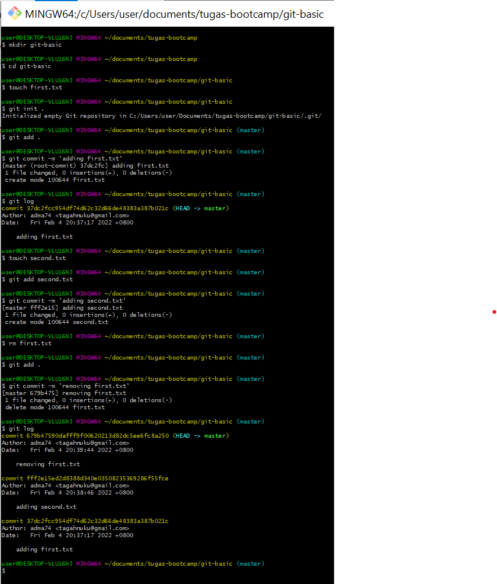

1.Create a folder called git-basic

answer : mkdir git-basic

2.cd into the git-basic folder

answer : cd git-basic

3.Create a file called first.txt

answer : touch first.txt

4.Initialize an empty git repository

answer : git init . / git init first.txt

5.Add first.txt to the staging area

answer : git add . / git add first.txt

6.Commit with the message "adding first.txt"

answer : git commit -m 'adding first.txt'

7.Check out your commit with git log

answer : git log

8.Create another file called second.txt

answer : touch second.txt

9.Add second.txt to the staging area

answer : git add . / git add second.txt

10.Commit with the message "adding second.txt"

answer : git commit -m 'adding second.txt'

11.Remove the first.txt file

answer : rm first.txt / rm -r first.txt

12.Add this change to the staging area

answer : git add .

13.Commit with the message "removing first.txt"

answer : git commit -m 'removing first.txt'

14.Check out your commits using git log

answer : git log

link github : [https://github.com/adma74/git-basic/commits/main](https://github.com/adma74/git-basic/commits/main)

