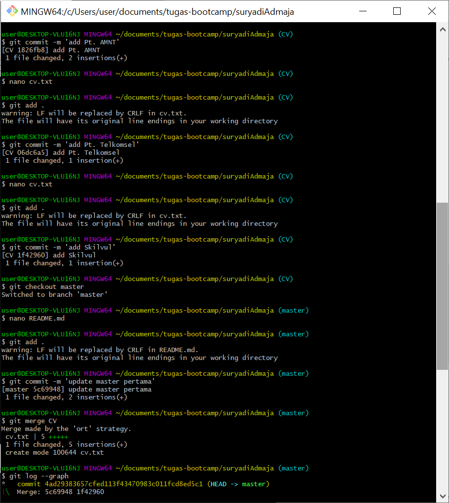

1.membuat sebuah folder kosong dengan namamu sendiri

answer: mkdir suryadiAdmaja

2.membuat sebuah file dengan nama README.md,

answer: touch README.md

isi file tersebut dengan kalimat
"Halo perkenalkan aku halaman utama"

anwer: echo "Halo perkenalkan aku halaman utama" > README.md

3.insialisasi folder tersebut dengan Git,
answer: git init .

kemudian dokumentasikan menggunakan commit dengan pesan
"Inisialisasi Git Repository"

answer: git add .

git commit -m 'Inisialisasi Git Repository'

4.buat branch baru dengan nama cv, hal ini berguna agar histori kita tidak tercampur

answer: git branch CV

5.pindah branch kedalam cv, 

answer: git checkout CV / git switch CV

kemudian buat file dengan nama cv.txt 

answer: touch cv.txt

dan isi file tersebut dengan kalimat:
"Ini adalah file CV"

answer: echo "Ini adalah file CV"

kemudian dokumentasikan menggunakan commit dengan pesan
"Inisialisasi CV"

answer: git add .

git commit -m 'Inisialisasi CV'

7.tambahkan 3 perusahaan yang akan kamu lamar, dan setiap menuliskan 1 nama perusahaan kamu harus melakukan dokumentasi menggunakan commit

answer: nano cv.txt ($pt yang saya sukai)

//note: klik "ctrl+s' lalu 'ctrl+x' untuk keluar dari menu nano

git add .

git commit -m 'add $pt yang saya input tadi'

//note : ulangi langka ini sebanyak 3 kali

8.kembali ke branch master

answer: git checkout master / git switch master

9.ubah file README.md menjadi
Halo perkenalkan aku halaman utama

Ini adalah update pertama pada branch master

answer: nano README.md

Halo perkenalkan aku halaman utama

Ini adalah update pertama pada branch master

//note: klik "ctrl+s' lalu 'ctrl+x' untuk keluar dari menu nano

jangan lupa untuk mendokumentasikannya menggunakan commit dengan pesan
"update master pertama"

answer: git add .

git commit -m 'update master pertama'

10.gabungkan branch cv kedalam branch master menggunakan perintah git merge

answer: git merge CV

11.unggah Git Repository tersebut kedalam GitHub

answer: git remote add (link new repository)

git push origin -u master

#Untuk mengetahui apakah pekerjaan yang kalian buat sudah sesuai atau tidak, kalian dapat menggunakan perintah git log --graph untuk menampilkan grafik dari repository kita.

link [github](https://github.com/adma74/suryadiAdmaja)

